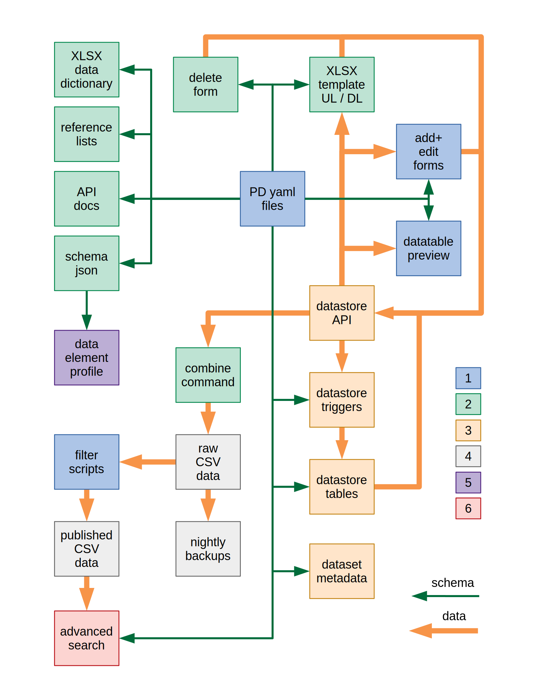
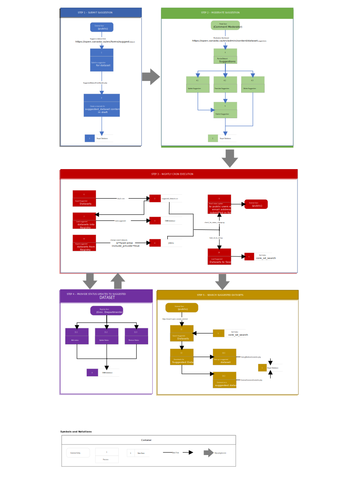

# ckanext-canada

Government of Canada CKAN Extension - Extension à CKAN du Gouvernement du Canada

Features:

* Forms and Validation for GoC Metadata Schema

Installation:

* Use [open-data fork of CKAN](https://github.com/open-data/ckan>),
  branch canada-v2.6

From a clean database you must run:

```bash
ckanapi load organizations -I transitional_orgs.jsonl
```

Once to create the organizations this extension requires
before loading any data.


## Plugins in this extension

`canada_forms`
  dataset forms for Open Canada metadata schema

`canada_public`
  base and public facing Open Canada templates (requires
  `canada_forms`)

`canada_internal`
  templates for internal site and registration (requires
  `canada_forms`` and `canada_public``)

`canada_package`
  package processing between CKAN and Solr

`canada_obd`
  Open By Default site plugin


## Requirements

Project | Github group/repo | Branch | Plugins
--- | --- | --- | ---
CKAN | [open-data/ckan](https://github.com/open-data/ckan) | canada-v2.6 | N/A
canada extension | [open-data/ckanext-canada](https://github.com/open-data/ckanext-canada) | master | see above
Scheming extension | [open-data/ckanext-scheming](https://github.com/open-data/ckanext-scheming) | master | scheming_datasets
Fluent extension | [open-data/ckanext-fluent](https://github.com/open-data/ckanext-fluent>) | master | N/A
ckanapi | [ckan/ckanapi](https://github.com/ckan/ckanapi>) | master | N/A
ckanext-googleanalytics | [ofkn/ckanext-googleanalytics](https://github.com/okfn/ckanext-googleanalytics>) | master | googleanalytics
Recombinant extension | [open-data/ckanext-recombinant](https://github.com/open-data/ckanext-recombinant) | master | recombinant


## OD Configuration: development.ini or production.ini

The CKAN ini file needs the following settings for the registry server:

```ini
ckan.plugins = dcat dcat_json_interface googleanalytics canada_forms canada_internal
        canada_public canada_package canada_activity datastore recombinant
        scheming_datasets fluent extendedactivity
```

For the public server use only:

```ini
ckan.plugins = dcat dcat_json_interface googleanalytics canada_forms
        canada_public canada_package scheming_datasets fluent

canada.portal_url = http://myserver.com

adobe_analytics.js = //path to the js file needed to trigger Adobe Analytics

foresee.survey_js_url = // path to the js file for adding a layer of Foresee survey for conducting user experience testing 
```

Both servers need:

```ini
licenses_group_url = file://<path to this extension>/ckanext/canada/public/static/licenses.json

ckan.i18n_directory = <path to this extension>/build

ckan.auth.create_dataset_if_not_in_organization = false

ckan.activity_streams_email_notifications = false

ckan.datasets_per_page = 10

googleanalytics.id = UA-1010101-1 (your analytics account id)
googleanalytics.account = Account name (i.e. data.gov.uk, see top level item at https://www.google.com/analytics)
```

## OD Configuration: Adding WET Resource files

For the use of the Portal or Registry sites, the installation of the WET-BOEW theme extension isn't required anymore, because the templates it provides are now included in the `canada_public` and `canada_internal` plugins. All what's needed is to add the resource files:

### Externally hosted:

Set `wet_boew.url` (in your .ini file) to the root URL where the WET resources are hosted:

*Example*:

```ini
wet_boew.url = http://domain.com/wet-boew/v4.0.31
```

### Internally Hosted:

1. Extract the WET 4.0.x core CDN and desired themes cdn package to a folder::

	```bash
        export WET_VERSION=v4.0.31
        export GCWEB_VERSION=v5.1
        mkdir wet-boew && curl -L https://github.com/wet-boew/wet-boew-cdn/archive/$WET_VERSION.tar.gz | tar -zx --strip-components 1 - -directory=wet-boew
        mkdir GCWeb && curl -L https://github.com/wet-boew/themes-cdn/archive/$GCWEB_VERSION-gcweb.tar.gz | tar -zx --strip-components 1 --directory=GCWeb
	```

2. Set the `extra_public_paths` settings to that path where the files are extracted:

	*Example*:

	```ini
	extra_public_paths = /home/user/wet-boew/v4.0.31
	```


### Additional Configuration:

Set `wet_theme.geo_map_type` to indicate what style of [WET Geomap widget](http://wet-boew.github.io/wet-boew/docs/ref/geomap/geomap-en.html) to use. Set this to either 'static' or 'dynamic':

```ini
wet_theme.geo_map_type = static
```


## OBD Configuration

We use a different list of plugins for Open By Default:

```ini
ckan.plugins = dcat dcat_json_interface googleanalytics canada_forms
        canada_obd canada_package wet_boew_gcweb scheming_datasets
        fluent cloudstorage

ckan.extra_resource_fields = language
```

Update OBD documents (example):

```bash
touch /tmp/marker
import_xml2obd.py  pull ./production.ini ./obd-repo  > /tmp/pull.log
find ./obd-repo -type f -newer /tmp/marker > ./new.txt
import_xml2obd.py ./obd-repo  http://obd-dev.canadacentral.cloudapp.azure.com/ckan ./new.txt >  ./data/obd-20170704.jsonl
import_xml2obd.py upload  http://obd-dev.canadacentral.cloudapp.azure.com/ckan <site API key> ./data/obd-20170704.jsonl ./obd-repo

Delete OBD documents (only change the dataset state):
import_xml2obd.py delete ./to_delete.csv ./obd-repo  http://obd-dev.canadacentral.cloudapp.azure.com/ckan <site API key>

Verify OBD documents:
# check resource exists
import_xml2obd.py <site_url> azure_user azure_key azure_container

# check duplicates
import_xml2obd.py de-dup <site_url>
```

## Configuration: Solr

This extension uses a custom Solr schema based on the ckan 2.6 schema. You can find the schema in the root directory of the project.
Overwrite the default CKAN Solr schema with this one in order to enable search faceting over custom metadata fields.

You will need to rebuild your search index using:

```bash
paster --plugin ckan search-index rebuild
```

## Compiling the updated French localization strings

Each time you install or update this extension you need to install the
updated translations by running:

```bash
bin/build-combined-ckan-mo.sh
```

This script overwrites the ckan French translations by combining it with
ours.

# Integrating with OGC Django Search App

Optionally the extension can integrate with the OGC Search application by updating the
custom Solr core used by the search application in addition to the regular CKAN Solr core.
When enabled, the extension will update the second Solr core after a package update or delete.
The hooks for this are set in the DataGCCAPackageController. For this to happen, two configuration values
need to be set:

```ini
ckanext.canada.adv_search_enabled = True
ckanext.canada.adv_search_solr_core = http://127.0.0.1:8983/solr/core_od_search
```

The first setting must to set to true to enable the integration, and the second setting provides the URL to the
custom OGC Search core.

The Django search code uses the NLTK toolkit (http://www.nltk.org/) to extract a summarized description. To install
the NLTK parsers, run the following python commands after activating the virtual environment:

```ini
import nltk
nltk.download('punkt')
```

If not integrating, these settings may be omitted or `ckanext.canada.adv_search_enabled` may be set to `False`.

## Migrating Proactive Disclosure (recombinant) data

First extract the current version of the data from the registry for each table, e.g for contracts migrations
we need contracts.csv and contracts-nil.csv:

```bash
mkdir migrate-contracts-2020-08-07  # a new working directory
paster --plugin=ckanext-recombinant recombinant combine contracts contracts-nil -d migrate-contracts-2020-07-08 -c $REGISTRY_INI
```

Remove the old tables from the database so that tables with the new schema can be created when we load the migrated
data, deleting contracts will delete both the contracts and contracts-nil tables:

```bash
paster --plugin=ckanext-recombinant recombinant delete contracts -c $REGISTRY_INI
```

Deploy the new version of the code, for our prod registry site that would be:

```bash
fab pull registry
```

Migrate the data with the script deployed as part of the changes. The output csv files need to have
the same names as the input files for loading to work in the next step.

```bash
cd migrate-contracts-2020-08-07
mkdir new err  # for migrated data and error logs
.../ckanext-canada/bin/migrate/migrate_contracts_2019_11.py <contracts.csv >new/contracts.csv 2>err/contracts.err
.../ckanext-canada/bin/migrate/migrate_contracts_nil_2019_11.py <contracts-nil.csv >new/contracts-nil.csv 2>err/contracts-nil.err
ls -al err
```

Records removed in the data migration will appear in the error logs.
Also check that the migrated data is comparable in size to the original
data in just in case something interrupted the migration.

Load the migrated data back into the registry, capturing any validation errors:

```bash
paster --plugin=ckanext-recombinant recombinant load-csv new/contracts.csv new/contracts-nil.csv -c $REGISTRY_INI 2>err/load-contracts.err
ls -al err/load-contracts.err
```

If there are validation errors or records removed during migration, consider
revising the migration script to allow more records to be migrated without manual intervention.

Inform the business owner or source departments about all records that were removed as part of the
final data migration or due to validation errors so that data can be corrected and re-imported.


## Proactive Disclosure Data Flow



1. ckanext-canada (this repository)
   - [PD yaml files](ckanext/canada/tables) are read by ckanext-recombinant and used to
     generate most of the pages, tables, triggers and metadata shown.
   - [add+edit forms](ckanext/canada/templates/internal/recombinant) use form snippets
     from ckanext-scheming and validation enforced by datastore triggers. They are
     currently part of the ckanext-canada extension but should be moved into
     ckanext-recombinant or another reusable extension once the trigger-validation
     pattern becomes standardized
   - [datatable preview](ckanext/canada/templates/internal/package/wet_datatable.html)
     is part of ckanext-canada because this code predates the datatables view feature
     that is now part of ckan. It should be removed from here so we can use the ckan
     datatable view instead
   - [filter scripts](bin/filter) cover all the business logic required to "clean" PD data
     before it is released to the public. a [Makefile](bin/pd/Makefile) is used to
     extract raw CSV data, make backups, run these filters and publish CSV data
2. [ckanext-recombinant](https://github.com/open-data/ckanext-recombinant)
   - XLSX data dictionary
   - reference lists
   - API docs
   - schema json
   - delete form
   - XLSX template UL/DL
   - combine command
3. [ckan](https://github.com/ckan/ckan)
   - datastore API
   - datastore triggers
   - datastore tables
   - dataset metadata
4. CSV files
   - raw CSV data
   - nightly backups
   - published CSV data
5. [deplane](https://github.com/open-data/deplane)
   - data element profile
6. [ogc_search](https://github.com/open-data/ogc_search)
   - advanced search

## Suggest a Dataset Data Flow



The "Suggest a Dataset" feature integrates CKAN with both Drupal and Django Search.

1. Submit Suggestion: The process begins with external public users submitting the
[Suggest a Dataset](https://open.canada.ca/en/forms/suggest-dataset) form on Drupal. As a result of submission,
a new node of content type `suggested_dataset` is created by the
[webform handler](https://github.com/open-data/og/blob/ff0d819ce5c87ee61fd2c5436e9a02028031ac51/modules/custom/og_ext_webform/src/Plugin/WebformHandler/SuggestedDatasetFormHandler.php#L21).

2. Moderate Suggestion: A registered user with role `comment_moderator` on Drupal updates and/or adds translation
to the suggested dataset. The user may also choose to delete the suggestion if it is not relevant or a duplicate.
Once translation is added, the user publishes the suggestion.

3. Nightly Cron: A number of cron jobs are responsible for cross-integration.
    - Suggested datasets are exported from Drupal as a CSV using a
    [cron hook](https://github.com/open-data/og/blob/ff0d819ce5c87ee61fd2c5436e9a02028031ac51/modules/custom/og_ext_cron/src/Utils/CronFunctions.php#L107)
    - The exported CSV is used to
    [load suggested datasets](https://github.com/open-data/ckanext-canada/blob/f7375feb2ac265e2beca939fd7b62a0298a62bce/ckanext/canada/commands.py#L452)
    in the Registry
    - Next, the status updates for all suggested datasets is exported from the Registry in a JSON file using
    `ckanapi search datasets q=type:prop include_private=true`
    - [New status updates are compared with existing status updates](https://github.com/open-data/ogc_search/blob/master/ogc_search/suggested_dataset/management/commands/check_for_status_change.py) 
    in the Solr index and emails are sent out to external public users for any new status updates
    - New status updates exported as JSON are
    [loaded into to the Solr index](https://github.com/open-data/ogc_search/blob/master/ogc_search/load_sd_to_solr.py)

4. Provide status updates: Registry users can view a list of suggested datasets for their organization and can provide
an update on progress.

5. Search suggested datasets: External public users can [search](https://search.open.canada.ca/en/sd)
a list of suggested datasets. Each suggested dataset has a details page which shows all the status updates for a
suggestion. Users can [vote](https://github.com/open-data/og/blob/ff0d819ce5c87ee61fd2c5436e9a02028031ac51/modules/custom/voting_webform/src/Controller/VotingWebformController.php#L89)
on a suggestion or [add comments](https://github.com/open-data/og/blob/master/modules/custom/external_comment/src/Controller/ExternalCommentController.php).
The votes and comments are stored in Drupal.
